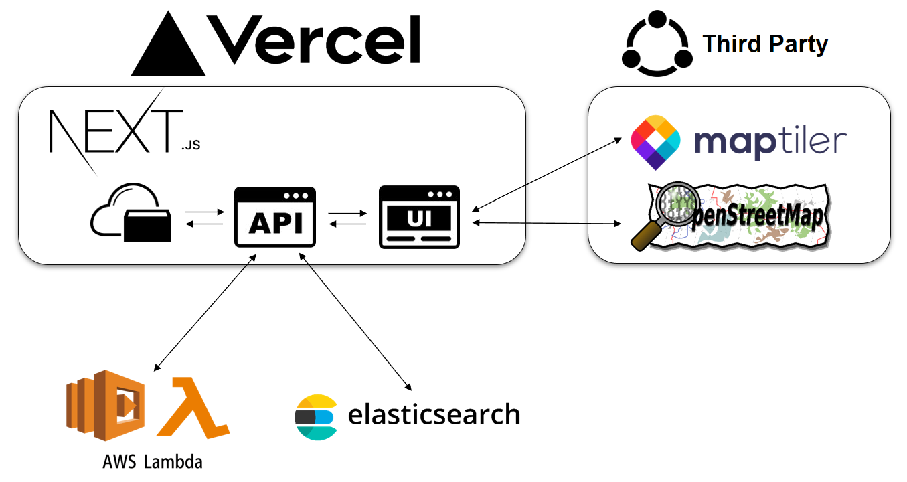

# Projekt-WI20-Web

  

- [Projekt-WI20-Web](#projekt-wi20-web)
    - [Solution](#solution)
      - [Live production demo:](#live-production-demo)
  - [License](#license)

### Solution

  

#### Live production demo:

> View the live demo at
- **[Production](https://projekt-wi-20-web.vercel.app/explore)**

## License

This project uses MIT license: [License](LICENSE)
